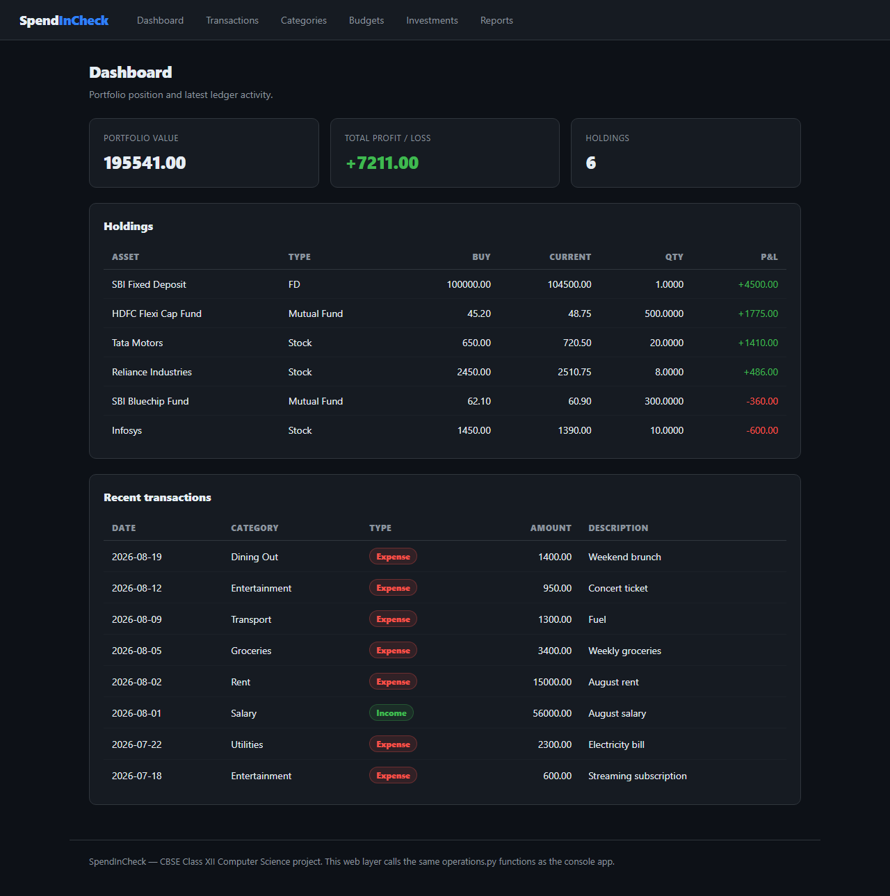
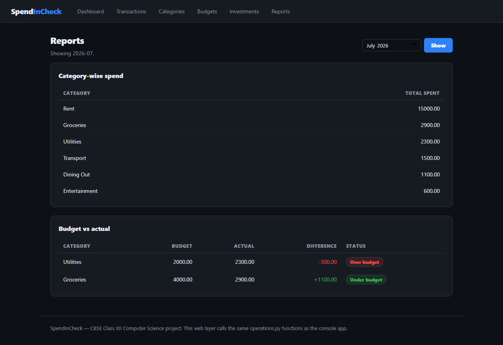
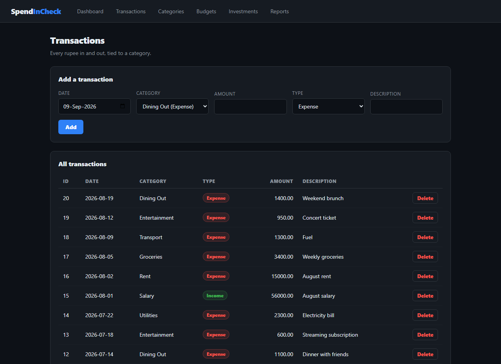

# SpendInCheck

**Know whether you're on budget — not just what you spent.**

SpendInCheck is a personal finance tracker that ties three things most trackers keep
apart: where your money goes, what you planned to spend, and what your investments are
actually worth. It answers the question a list of transactions can't — *am I over or
under, and by how much?*

Built as a console application and a web app on the same engine.

The project was written against **MySQL** for the CBSE syllabus, which requires
`mysql.connector` and raw SQL. The hosted copy runs on **PostgreSQL (Supabase)**,
since no free MySQL host stays awake reliably; the two differ only in the driver
and a handful of dialect details.

---

## What it does

**Tracks the ledger.** Every rupee in and out, filed under a category, with full
create / read / update / delete from either interface.

**Holds you to a budget.** Set a monthly limit per category. The budget report puts
planned against actual side by side and labels each category *Over budget*, *On budget*
or *Under budget* — the report the whole app is named for.

**Watches the portfolio.** Stocks, mutual funds and fixed deposits with buy price
against current price, giving per-holding profit and loss plus a portfolio total.

## Screens

| Dashboard | Reports |
|---|---|
|  |  |

| Transactions |
|---|
|  |

## Reports

| Report | Question it answers |
|---|---|
| Category-wise spend | Where did the money actually go this month? |
| Budget vs actual | Which categories blew past their limit, and by how much? |
| Portfolio P&L | Which holdings are up, which are down, what's the net? |

## How it's built

The design rule is that **all SQL lives in one module**. `operations.py` holds every
query as a single function that returns plain Python data and never prints anything.

That constraint is what makes the two interfaces possible. `main.py` (console) and
`app.py` (web) both call the same functions and differ only in how they present the
result — the web layer was added without changing a single line of SQL, and contains
no database code at all.

```
config.py   →  connection settings
db.py       →  opens/closes the database connection
operations.py  →  every SQL query, one function each   ← all database logic
      ├── main.py   →  console menus
      └── app.py    →  Flask routes + templates
```

Queries are parameterised throughout (`%s` placeholders, never string interpolation),
so user input can never be executed as SQL. Writes commit on success and roll back on
failure.

**Stack:** Python 3.11 · PostgreSQL (Supabase) / MySQL 8 · Flask · plain CSS

## Running it

```bash
pip install -r requirements.txt
```

Load the schema — `schema.sql` for MySQL, or `schema_postgres.sql` for Postgres:

```bash
mysql -u root -p < schema.sql
```

Put your connection settings in a `.env` file (see `.env.example`), then start
either interface:

```bash
python main.py
```

```bash
python app.py
```

The schema ships with seed data — categories, three months of transactions, budgets and
a mixed portfolio — so every report returns real output immediately.

## About

Built by [Ali Arbab](https://github.com/thealiarbab) as the CBSE Class XII Computer
Science (Code 083) practical project. `VIVA_NOTES.md` explains the schema design and
the reasoning behind each query.
